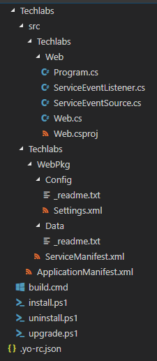
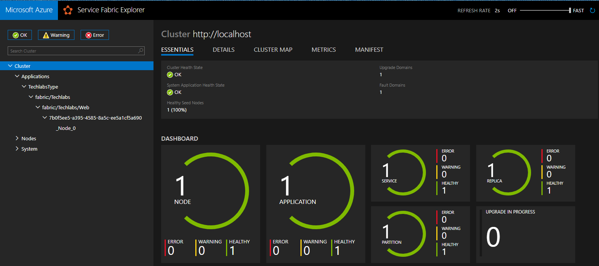
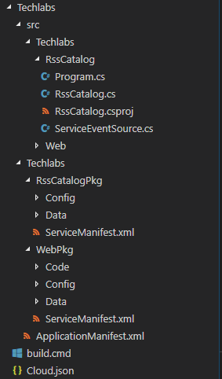

# Instructions

La liste des raccourcis VS Code est disponible pour [Windows](https://code.visualstudio.com/shortcuts/keyboard-shortcuts-windows.pdf).

## Récupérer la solution via Github

Pour aller plus vite, nous allons copier du code depuis ce repo, donc je vous conseille de le cloner ou de le télécharger :

```bash
git clone https://github.com/SoatGroup/techlabs-servicefabric-reliableservices.git
```

## Initialiser la solution

Créer un nouveau dossier, et ouvrir celui-ci dans VS Code.

### Générer l'application Service Fabric

Lancer la commande  **Service Fabric : Create Application**


Renseignez les paramètres suivants : 
* Application Template : **azuresfcsharp**
* Name of your application : **Techlabs**
* Choose a framework for your application : **Reliable Stateless Service**
* Enter the name of the service : **Web**

_Note : il est possible que le prompt de VSCode reste ouvert avec l'animation de chargement, il s'agit d'un bug, votre projet est normalement bien généré_



#### Mise à jour du code stateless

Une fois l'application générée, nous allons modifier cette application pour exposer des APIs et contenir un site statique. 

Pour cela, remplacer le contenu du dossier Web généré par VSCode, par le dossier se trouvant dans ce repository : **Lab/Step-1/Web**

Les modifications apportées sont les suivantes :
* Update vers une application netcoreapp2.1
* Création d'une application Web sous Kestrel
* Ajout de controlleurs
* Utilisation des endpoints Service Fabric pour le web

#### Création de l'endpoint pour notre application Web

Dans le fichier **/Techlabs/Techlabs/WebPkg/ServiceManifest.xml**, mettez à jour l'endpoint (ligne 32), par le code suivant : 

```xml
<Endpoint Protocol="http" Name="ServiceEndpoint" Type="Input" Port="8080" />
```

### Test de l'application en local

Afin de valider que cette première étape fonctionne, nous allons tester en local notre application.

Pour cela il faut commencer par build notre application via la commande **Service Fabric: Build Application**

Après un moment, il est possible de lancer l'application sur votre cluster local via la commande : **Service Fabric: Deploy Application (Localhost)**

Vous pouvez aller dorénavant à l'adresse de votre cluter local [http://localhost:19080](http://localhost:19080)

Vous devriez avoir un écran ressemblant à celui-ci :



Sur l'url suivante [http://localhost:8080/api/values](http://localhost:8080/api/values), vous pourrez voir une api de test qui vous prouvera que votre application Web est bien démarrée.

Par la suite, supprimez votre déploiement en local via la commande **Service Fabric: Remove Application**

## Ajouter un service de type Stateful

Lancer la commande suivante : **Service Fabric: Add Service**

Renseignez les paramètres suivants : 
* Application Template : **azuresfcsharp**
* Service Type : **CoreCLRStatefulService**
* Name of the service : **RssCatalog**

Vous devriez maintenant avoir l'arborescence suivante : 




### Mise à jour du code stateful

Une fois l'application générée, nous allons modifier cette application pour qu'elle puisse enregistrer des flux rss et récupérer les différents items ceux ci

Pour cela, remplacer le contenu du dossier RssCatalog généré par VSCode, par le dossier se trouvant dans ce repository : **Lab/Step-2/RssCatalog**

Les modifications apportées sont les suivantes :
* Update vers une application netcoreapp2.1
* Ajout du service remoting pour que notre service soit accessible
* Ajout des méthodes gérant notre catalogue

### Update de l'application Stateless

Pour communiquer entre notre application Web et notre application Stateful, nous allons rajouter un controller spécifique et nous allons mettre à jour notre fichier Web.csproj afin qu'il référence notre service Stateful pour utiliser le modèle qui convient et les interfaces.

Pour cela, remplacer le contenu du dossier Web généré par VSCode, par le dossier se trouvant dans ce repository : **Lab/Step-2/Web**

### Mise à jour de l'application Service Fabric

Dans le fichier **ApplicationManifest.xml**, nous allons ajouter ces paramètres : 

```xml
  <Parameters>
    <Parameter Name="RssCatalog_MinReplicaSetSize" DefaultValue="1" />
    <Parameter Name="RssCatalog_PartitionCount" DefaultValue="1" />
    <Parameter Name="RssCatalog_TargetReplicaSetSize" DefaultValue="1" />
    <Parameter Name="Web_InstanceCount" DefaultValue="-1"/>
  </Parameters>
```

Et nous allons modifier la déclaration de notre service par le code suivant : 

```xml
<Service Name="RssCatalog">
      <StatefulService ServiceTypeName="RssCatalogType" TargetReplicaSetSize="[RssCatalog_TargetReplicaSetSize]" MinReplicaSetSize="[RssCatalog_MinReplicaSetSize]">
        <UniformInt64Partition PartitionCount="[RssCatalog_PartitionCount]" LowKey="-9223372036854775808" HighKey="9223372036854775807" />
      </StatefulService>
    </Service>
```

### Déployer votre application en local

Pour cela, il faut build votre application via la commande **Service Fabric: Build Application**

Après un moment, il est possible de lancer l'application sur votre cluster local via la commande : **Service Fabric: Deploy Application (Localhost)**

Vous pouvez aller dorénavant à l'adresse de votre cluter local [http://localhost:19080](http://localhost:19080)

Vous pouvez voir un nouveau service est apparu. 
Il est par ailleurs possible d'aller sur [http://localhost:8080](http://localhost:8080) afin d'utiliser l'application pour voir son bon fonctionnement. 

### [Bonus] : Déployer sur un cluster distant 

### Créer un party cluster

Comment créer un party cluster : [http://mfery.com/blog/start-service-fabric-with-party-cluster/](http://mfery.com/blog/start-service-fabric-with-party-cluster/)

Récapitulatif de la création : 

* Se rendre sur l'url [https://try.servicefabric.azure.com/](https://try.servicefabric.azure.com/)
* Créer un compte via Github (ou Facebook) et l'utiliser pour se connecter
* Créer un cluster **Windows**
* Télécharger le PFX
* Installer le PFX via la commande Powershell dans le répertoire ou se trouve le PFX
```powershell
$cert = Import-PfxCertificate -FilePath .\party-cluster-XXXXXXX-client-cert.pfx -CertStoreLocation Cert:\CurrentUser\My -Password (ConvertTo-SecureString 1234567890 -AsPlainText -Force)
$cert.Thumbprint | Clip
```
Lorsque vous jouerez cette commande, le thumbprint sera ajouté au presse-papiers.
Il vous sera nécessaire pour le déploiement et cela vous évitera de le chercher dans les détails des certificats.

Si toutefois, vous n'aviez pas noté le thumbprint, vous pourrez toujours le récupérer via le Manager de Certificat (command certmgr).


#### Configuration de déploiement

Le fichier Cloud.json contient la configuration de connexion à votre cluster.
Il faut donc y modifier le certificat, le endpoint et le port (**19000**).
```Js
{
    "ClusterConnectionParameters": {
        "ConnectionIPOrURL": "win34397l57kh8.westus.cloudapp.azure.com",
        "ConnectionPort": "19000",
        "ClientKey": "",
        "ClientCert": "",
        "ServerCertThumbprint": "84ACA5A5EC27FB486BA950DEF5744D0042745502",
        "ClientCertThumbprint": "84ACA5A5EC27FB486BA950DEF5744D0042745502"
    }
}
```

### Déployer l'application 

Utiliser la commande **Service Fabric: Publish application** qui déploie votre application sur le cluster en se basant sur les fichiers **Cloud.json**, **install.ps1** et **uninstall.ps1**

### Vérifier votre déploiement

*Le déploiement peut prendre quelques minutes*

Allez sur l'url [https://win34397l57kh8.westus.cloudapp.azure.com:19080/Explorer/index.html](https://win34397l57kh8.westus.cloudapp.azure.com:19080/Explorer/index.html) (en fonction de votre cluster) pour vérifier que votre déploiement s'est bien passé.

Il est possible de voir le résultat de votre application sur le site : 
[http://win34397l57kh8.westus.cloudapp.azure.com](http://win34397l57kh8.westus.cloudapp.azure.com:8080) 